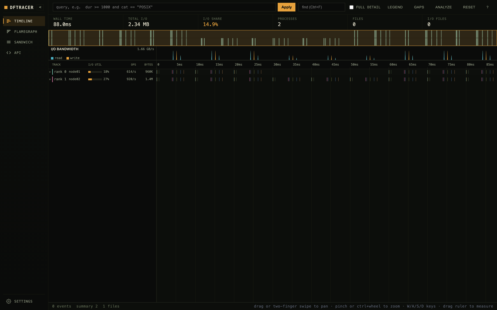
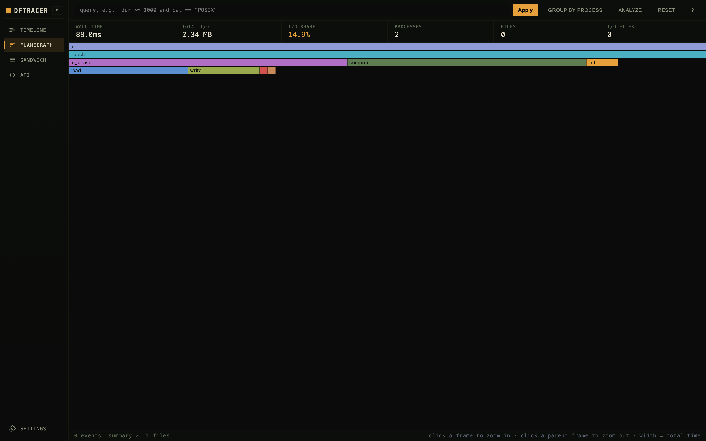
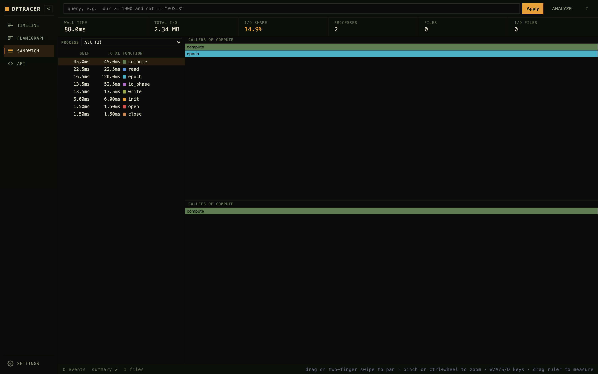
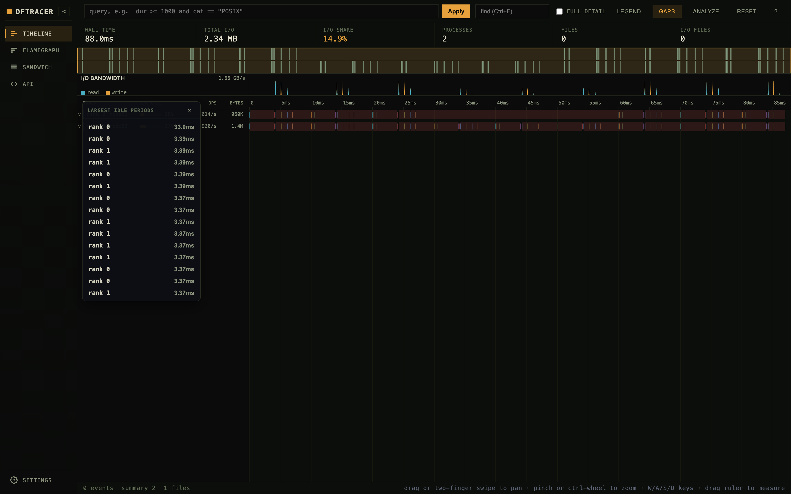
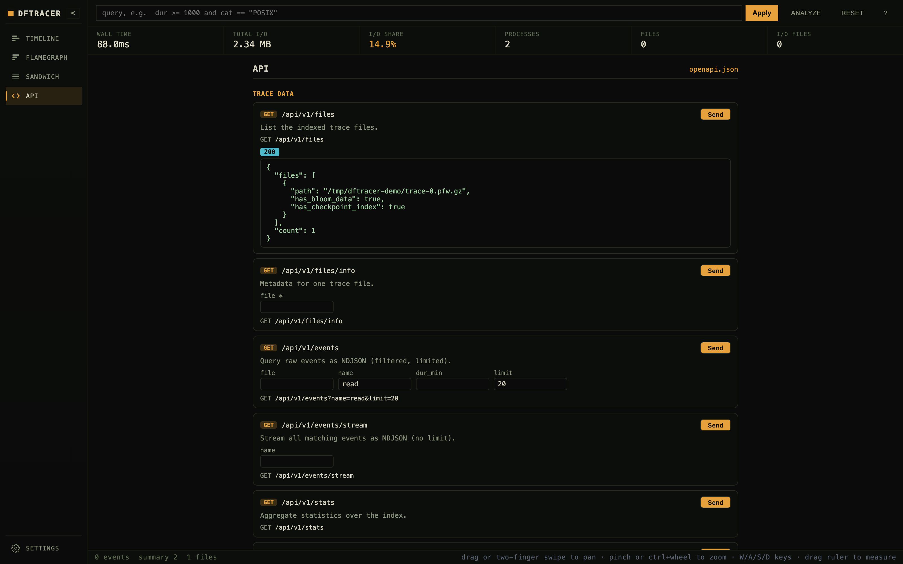

Trace Viewer (Web UI)
=====================

``dftracer_server`` serves an interactive, query-on-demand web UI for exploring
traces. Every viewport change re-queries the server at the right level of
detail, so it stays responsive on large traces. The UI is compiled into the
binary; no separate web server or Node runtime is needed at run time.

Opening the viewer
------------------

Start the server on a trace directory and open the printed URL:

.. code-block:: bash

    dftracer_server -d /path/to/traces
    # then open http://127.0.0.1:8080/

The server also serves:

- ``/`` - the timeline viewer (below).
- ``/api`` - an interactive :ref:`API explorer <api-explorer>`.
- ``/api/openapi.json`` - the OpenAPI 3.1 spec (see :doc:`server`).

From VS Code, the `DFTracer Viewer
<https://github.com/rayandrew/vscode-dftracer-viewer>`_ extension embeds the
same UI and launches the server for you.

The timeline
------------

The main view is a Perfetto-style timeline:

- **Lanes** are grouped by host, or ordered flat by rank when the trace carries
  ``PR`` (rank) metadata. Each process expands into its threads.
- **Density level-of-detail**: zoomed out, sub-pixel events are aggregated into
  density blocks so activity is still visible; zoom in and individual event
  slices load. Depth (call nesting) is stable across zoom.
- **KPIs** across the top: wall time, total I/O, I/O share, processes, files,
  and I/O files.
- **I/O bandwidth** strip: stacked read/write bytes over time.
- **Gutter metrics** per lane: I/O utilization, ops/s, and bytes (host rows
  show the mean and spread across their ranks).

Pan with drag or two-finger swipe; zoom with pinch or ctrl/cmd+wheel; ``W/A/S/D``
also navigate. Drag on the ruler to measure a range.

Query, search, and detail
--------------------------

- **Query box**: filter with the full DSL, e.g. ``dur >= 1000 and cat ==
  "POSIX"``. Invalid queries surface the server's error.
- **Find** highlights matching slices and steps between them.
- Hover a slice for a tooltip (name, category, duration, pid/tid, args); click
  to pin it in the inspector, which lists every field and arbitrary ``args``.
- **Full detail** disables level-of-detail aggregation for the current view.

Keyboard and mouse
------------------

.. list-table::
   :header-rows: 1
   :widths: 40 60

   * - Input
     - Action
   * - Drag, or two-finger swipe
     - Pan time
   * - Pinch, or Ctrl/Cmd + wheel
     - Zoom at the cursor
   * - Shift + wheel
     - Pan time (mouse-wheel users)
   * - Wheel (vertical)
     - Scroll lanes
   * - ``W`` / ``S`` (or Up / Down)
     - Zoom in / out at the cursor
   * - ``A`` / ``D`` (or Left / Right)
     - Pan left / right
   * - Double-click
     - Zoom toward the cursor
   * - Drag on the ruler, or Shift + drag
     - Select a time range to analyze
   * - Click a slice / click empty
     - Pin it in the inspector / clear the selection
   * - ``Esc``
     - Clear the selection or close a panel
   * - Ctrl/Cmd + ``F``
     - Focus the find box (``Enter`` / ``Esc`` to step matches / close)
   * - Click a frame / parent frame (flamegraph)
     - Zoom in / out

Flamegraph and sandwich
-----------------------

The **Flamegraph** (icicle) is the merged call tree built from ``ts``/``dur``
containment; identical name-paths fold together, and width is proportional to
inclusive time. Click a frame to zoom in, click a parent frame to zoom out.
Toggle **Group by process** to keep each process's tree separate.

The **Sandwich** (Speedscope-style) view lists every function with its self and
total time; selecting one shows its callers (inverted) and callees flamegraphs.
Scope it to a single process with the dropdown.

Gap analysis
------------

Toggle **Gaps** to surface the largest idle periods per lane. Idle spans are
shaded on the timeline and listed (longest first); click one to zoom to it.
Works both zoomed in (from real events) and zoomed out (from the busy fraction
of density blocks).

Analyze a range
---------------

Drag a time-range selection (or use **Analyze**) to aggregate the selection
server-side by name, file, process, or category, with bottleneck (inclusive
time) and bottom-up (self time) breakdowns.

.. _api-explorer:

API explorer
------------

The **API** view (and the standalone ``/api`` page) is an interactive reference
generated from the server's OpenAPI spec: every endpoint with editable query
knobs, a live request-URL preview, and a **Send** button that runs the request
against the current server and shows the response. See :doc:`server` for the
full REST API reference.

Settings
--------

The gear opens settings: switch between automatic (OS), light, and dark themes
(persisted), and, in the VS Code extension, set the server path and load a
trace file or directory.
